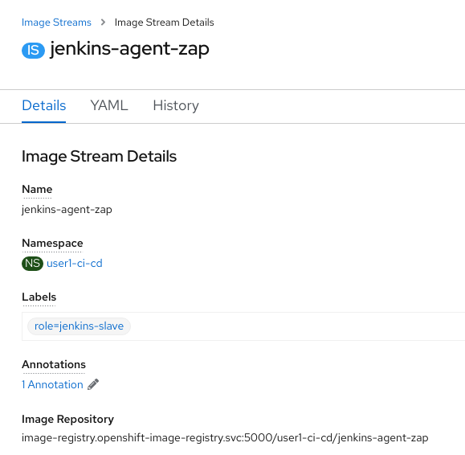
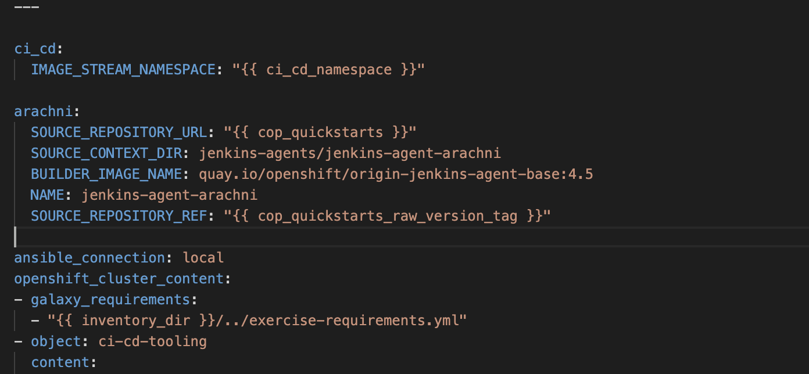
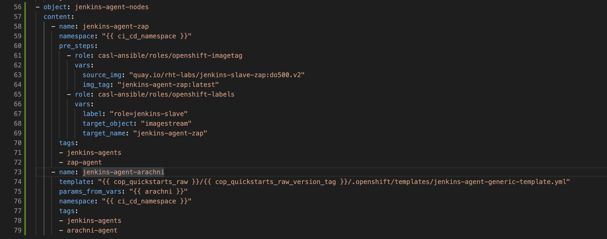

# An Enslaved Hope

> In this exercise we will introduce some new Jenkins agents that will be used in later exercises. We will also look at an alternative approach to doing build pipelines by creating an OpenShift buildConfig that contains our Jenkinsfile.


[image-ref](https://memegenerator.net/instance/76565947/days-since-its-been-0-days-since-a-jenkins-fail)

There are a number of ways pipeline as code can be achieved in Jenkins.

 * The Job DSL Plugin - this is a slightly older but very functional DSL mechanism to create reusable pipelines. Create a `groovy` file to run Jenkins Domain Specific Language to create jobs, functions and other items. In Jenkins; you then can execute this file which will build all of the config.xml files needed for each Job.

 * The Scripted Pipeline - The scripted pipeline introduced the Jenkinsfile and the ability for developers to write their Jenkins setup as groovy code. A repo with a Jenkinsfile in its root can be pointed to by Jenkins and it will automatically build out each of the stages described within. The scripted pipeline is ultimately Groovy at its core.

 * The Declarative Pipeline - This approach looks to simplify and opinionate what you can do and when you can do it in a pipeline. It does this by giving you top level `block` which define sections, directives and steps. The declarative syntax is not run as groovy but you can execute groovy inside script blocks. The advantage of it over scripted is validation of the config and lighter approach with requirement to understand all of the `groovy` syntax

_____

## Learning Outcomes
As a learner you will be able to
- Use a Jenkinsfile to create a declarative pipeline to build, bake and deploy the Todolist App
- Identify the differences between scripted, declarative and DSL pipelines
- Create Jenkins agent nodes for use in builds in future exercises

## Tools and Frameworks

1. [Zed Attack Proxy](https://www.owasp.org/index.php/OWASP_Zed_Attack_Proxy_Project) - The OWASP Zed Attack Proxy (ZAP) is one of the world’s most popular free security tools and is actively maintained by hundreds of international volunteers*. It can help you automatically find security vulnerabilities in your web applications while you are developing and testing your applications. Its also a great tool for experienced pentesters to use for manual security testing.
2. [Arachni Crawler](http://www.arachni-scanner.com/) - Arachni is a feature-full, modular, high-performance Ruby framework aimed towards helping penetration testers and administrators evaluate the security of modern web applications. It is free, with its source code public and available for review. It is versatile enough to cover a great deal of use cases, ranging from a simple command line scanner utility, to a global high performance grid of scanners, to a Ruby library allowing for scripted audits, to a multi-user multi-scan web collaboration platform. In addition, its simple REST API makes integration a cinch.
3. [OpenShift Pipeline](https://docs.openshift.com/container-platform/3.11/dev_guide/openshift_pipeline.html) - OpenShift Pipelines give you control over building, deploying, and promoting your applications on OpenShift. Using a combination of the Jenkins Pipeline Build Strategy, Jenkinsfiles, and the OpenShift Domain Specific Language (DSL) (provided by the OpenShift Jenkins Client Plug-in), you can create advanced build, test, deploy, and promote pipelines for any scenario.

## Big Picture
> From the previous exercise; we gated our pipeline. Now we will add a pipeline-as-code in the form of the Jenkinfile and re-use it on the Backend too.


_____

<!-- ## 10,000 Ft View
> The goal of this exercise is to move to using the Jenkinsfile in the todolist-api and todolist projects. Additionally we will create new agents for use in the next exercise.

1. On Jenkins; create a multibranch pipeline project to scan the GitLab endpoint for each app. Use the Jenkinsfile provided to run the stages. Replace `<YOUR_NAME>` with the appropriate variable.

2. Create two new Jenkins agents for the `OWASP ZAP` scanner and the `Arachni` WebCrawler -->

## Step by Step Instructions

### Part 1 - Security Scanning Agents
> _This part of the exercise focuses on updating the `enablement-ci-cd` repo with some new jenkins-agent pods for use in future exercise. We will use two different methods to import these agents, one by tagging a prebuilt image and two by building the image in the cluster_

#### 1a - OWASP ZAP
> _OWASP ZAP (Zed Attack Proxy) is a free open source security tool used for finding security vulnerabilities in web applications._

1. On your  editor; move to the `enablement-ci-cd` repository and open the `inventory/host_vars/ci-cd-tooling.yml`.

2. Create a new Ansible object to be consumed by the OpenShift Applier at the bottom of the file. 

<kbd>📝 *inventory/host_vars/ci-cd-tooling.yml*</kbd>
```yaml
# JENKINS AGENTS
- object: jenkins-agent-nodes
  content:
```

3. The ZAP image we will use is pre-built and hosted on Quay. The Dockerfile used to built it can be found on the Red Hat Communities of Practice Containers Quickstarts repository, along with a host of other useful [Jenkins agents](https://github.com/redhat-cop/containers-quickstarts/tree/master/jenkins-agents). To save time, we will use a prebuilt image. As we did with our `jenkins-agent-npm`, let's add some `pre_steps` for the applier to pull this image into our cluster and label it for use in Jenkins.

<kbd>📝 *inventory/host_vars/ci-cd-tooling.yml*</kbd>
```yaml
# JENKINS AGENTS
- object: jenkins-agent-nodes
  content:
    - name: jenkins-agent-zap
      namespace: "{{ ci_cd_namespace }}"
      pre_steps:
        - role: casl-ansible/roles/openshift-imagetag
          vars:
            source_img: "quay.io/rht-labs/jenkins-slave-zap:do500.v3"
            img_tag: "jenkins-agent-zap:latest"
        - role: casl-ansible/roles/openshift-labels
          vars:
            label: "role=jenkins-slave"
            target_object: "imagestream"
            target_name: "jenkins-agent-zap"
      tags:
      - jenkins-agents
      - zap-agent
```


4. Run the ansible playbook filtering with tag `zap` so only the zap build pods are run.

```bash
# login if needed
oc login -u <username> -p <password> <CLUSTER_URL>
```

```bash
cd /projects/enablement-ci-cd
ansible-playbook apply.yml -e target=tools \
     -i inventory/ \
     -e "filter_tags=zap-agent"
```

5. Head to `<CLUSTER_URL>` on OpenShift and move to Builds > Images in your CI/CD project. You should see `jenkins-agent-zap` Image Stream has been imported.


#### 1b - Arachni Scan
> _Arachni is a feature-full, modular, high-performance Ruby framework aimed towards helping penetration testers and administrators evaluate the security of web applications._

1. Create an object in `inventory/host_vars/ci-cd-tooling.yml` called `arachni` and add the following variables to tell your template where to find the agent definition to be built.

<kbd>📝 *inventory/host_vars/ci-cd-tooling.yml*</kbd>
```yaml

  arachni:
    SOURCE_REPOSITORY_URL: "{{ cop_quickstarts }}"
    SOURCE_CONTEXT_DIR: jenkins-agents/jenkins-agent-arachni
    BUILDER_IMAGE_NAME: quay.io/openshift/origin-jenkins-agent-base:4.5
    NAME: jenkins-agent-arachni
    SOURCE_REPOSITORY_REF: "{{ cop_quickstarts_raw_version_tag }}"
```


2. Add the definition below underneath the Zap config

<kbd>📝 *inventory/host_vars/ci-cd-tooling.yml*</kbd>
```yaml
    - name: jenkins-agent-arachni
      template: "{{ cop_quickstarts_raw }}/{{ cop_quickstarts_raw_version_tag }}/.openshift/templates/jenkins-agent-generic-template.yml"
      params_from_vars: "{{ arachni }}"
      namespace: "{{ ci_cd_namespace }}"
      tags:
      - jenkins-agents
      - arachni-agent
```


3. Run the ansible playbook filtering with tag `arachni` so only the arachni build pods are run.
```bash
ansible-playbook apply.yml -e target=tools \
     -i inventory/ \
     -e "filter_tags=arachni-agent"
```

4. With these changes in place, push your changes to the `master` branch.
```bash
git add .
```
```bash
git commit -m "ADD - Arachni and Zap scanning images"
```
```bash
git push
```

5. Your OpenShift cluster should now show that the Arachni agent has been built in your `ci-cd` namepsace.


### Part 2 - OCP Pipeline
> _This exercise adds a new BuildConfig to our cluster for the todolist-apps to run their pipelines in OpenShift using the OpenShift Jenkins Sync Plugin. We will use the OpenShift Applier to create the content in the cluster_

1. Change directory to `todolist`
```bash
cd /projects/todolist
```

2. Open the `todolist` app in your cloud ide. Open `.openshift-applier/template/ocp-pipeline` directory. This template creates a BuildConfig for OpenShift with a Jenkinsfile from a given repo. In this case; it will be the `Jenkinsfile` at the root of our application.

3. Open the `.openshift-applier/params/ocp-pipeline` file and update `PIPELINE_SOURCE_REPOSITORY_URL` with the git url of your project (Don't forget to add the `.git` at the end). For example:
```
PIPELINE_SOURCE_REPOSITORY_URL=https://gitlab.<APPS_URL>/<GIT_USERNAME>/todolist.git
PIPELINE_SOURCE_REPOSITORY_REF=develop
PIPELINE_SOURCE_SECRET=git-auth
NAME=todolist
```

4. Create a new object in `.openshift-applier/inventory/group_vars/all.yml` to drive the `ocp-pipeline` template with the parameters file you've just created. It can be put under the existing `todolist-build` object.

<kbd>📝 *.openshift-applier/inventory/group_vars/all.yml*</kbd>
```yaml
  - name: todolist-pipeline
    template: "{{ playbook_dir }}/templates/ocp-pipeline.yml"
    params: "{{ playbook_dir }}/params/ocp-pipeline"
    namespace: "{{ ci_cd_namespace }}"
    tags:
    - pipeline
```


5. Log in to OpenShift using the `oc` client, and use the OpenShift Applier to create the cluster content
```bash
ansible-playbook .openshift-applier/apply.yml -i .openshift-applier/inventory/ \
     -e "filter_tags=pipeline"
```

6. With these changes in place, commit your changes to GitLab
```bash
git add .
```
```bash
git commit -m "ADD - ocp pipeline in git repo"
```
```bash
git push
```

7. Login to your OpenShift Cluster and go to the `<YOUR_NAME>-ci-cd` namespace. On the side menu; hit `Builds > Pipeline` to see your newly created pipeline running in OCP Land.


8. Running the pipeline from here will run it in Jenkins. You can see the job sync between OpenShift and Jenkins if you login to Jenkins. You should see a folder with `<YOUR_NAME>-ci-cd` and your pipeline jobs inside of it.


_____

## Extension Tasks
> _Ideas for go-getters. Advanced topic for doers to get on with if they finish early. These will usually not have a solution and are provided for additional scope._

Jenkins S2I
 - Add the multi-branch configuration to the S2I to have Jenkins come alive with the `todolist` cooked into it for future uses.

Jenkins Pipeline Extension
 - Add an extension to the pipeline that promotes code to the UAT environment once the master job has been successful.
 - Use a WAIT to allow for manual input to approve the promotion

Jenkins e2e extension (blue/green)
 - Add a step in the pipeline to only deploy to the `test` environment if the e2e tests have run successfully against which ever environment (blue or green) is not deployed.

<!-- ## Additional Reading
> List of links or other reading that might be of use / reference for the exercise

## Slide Links

- [Intro](https://docs.google.com/presentation/d/1B3Fv4g66zZ8ZkqBq9TYmImJhUDvMecXCt4q3DXGWhjc/)
- [Wrap-up](https://docs.google.com/presentation/d/1EOk6y798Xh1hsaQlxRuqyr23FIIf7sNY4any_yXIL7A/)
- [All Material](https://drive.google.com/drive/folders/1oCjpl33Db7aPocmpu3NNF0B9czRvFq3m) -->

